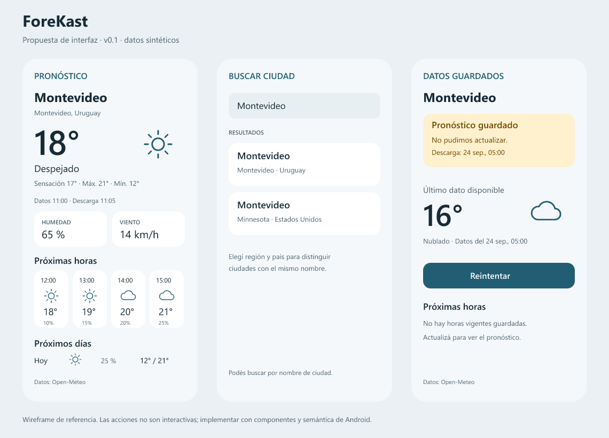

# ForeKast — Android y laboratorio de aprendizaje

**App 0.4.0 · I0–I4 + motor I6a sin UI · 28 de septiembre de 2026.** SPEC de producto v0.1 como objetivo del MVP.

ForeKast es una app Android nativa en Kotlin para consultar el tiempo, entender la evolución de las próximas horas y guardar ciudades. Tiene una segunda función: servir como sistema pequeño pero real para estudiar Android, Kotlin y arquitectura desde una experiencia previa en iOS e ingeniería de software.

El repositorio contiene una aplicación Android compilable con Compose, Navigation 3, ViewModel, coroutines/StateFlow y Open-Meteo mediante Ktor. Incluye pronóstico real, búsqueda remota de ciudades, favoritas persistentes, unidades y tema. Conserva una compilación demo con laboratorio de estados. **Room guarda ciudades, selección y pronósticos; DataStore conserva unidades y tema.** El motor local I6a calcula insights con reglas explicables y pruebas, aún sin UI. Python sigue siendo un contrato de referencia, sin servicio desplegado.

## Ejecutar la app

Abrí esta carpeta en Android Studio y ejecutá `app` en un emulador o dispositivo Android 8+. Para compilar desde PowerShell:

```powershell
.\scripts\gradle.ps1 :app:assembleDebug
```

El APK queda en `app/build/outputs/apk/debug/app-debug.apk`. Setup, versiones y pruebas: [TOOLCHAIN](docs/TOOLCHAIN.md). Para estudiar el código: [recorrido I0 + I1](LearnDocs/08-I0-I1-code-tour.md). Para seguir la integración real: [recorrido I2](LearnDocs/09-I2-network.md). Para seguir la persistencia: [recorrido I3](LearnDocs/10-I3-persistence.md). Para estudiar las pruebas y la accesibilidad: [recorrido I4](LearnDocs/11-I4-quality.md). Para analizar las reglas locales: [I6a](LearnDocs/12-I6-local-insights.md). Para explorar estados sintéticos, compilá con `-PforekastDemo=true`; después Ajustes → Laboratorio de estados → Ver pronóstico.

La primera apertura muestra una bienvenida y pide elegir ciudad. Después recupera la selección, favoritas, preferencias y última descarga al reabrir, incluso sin conexión si hay caché utilizable. Se conservan cinco favoritas más una ciudad activa no favorita. La caché vence a los siete días; Ajustes permite borrar ciudades y pronósticos con confirmación, conservando unidades y tema. Desinstalar elimina todo el almacenamiento. La demo continúa siendo de sesión.

## Empezar por aquí

1. [SPEC del producto](docs/SPEC.md): alcance, pantallas y comportamientos verificables.
2. [Arquitectura](docs/ARCHITECTURE.md): límites, estado, almacenamiento y concurrencia.
3. [Decisiones y alternativas](docs/adr/README.md): por qué elegimos este diseño.
4. [Hoja de aprendizaje](LearnDocs/README.md): recorrido con ejercicios e ingeniería inversa.
5. [Roadmap](docs/ROADMAP.md): secuencia sugerida y futuras ramas.

## Mapa del paquete

| Documento | Para qué sirve |
| --- | --- |
| [API meteorológica](docs/WEATHER_API.md) | Proveedor, requests, normalización, errores y atribución |
| [Diseño y assets](docs/DESIGN.md) | Jerarquía visual, estados, accesibilidad y reemplazo de recursos |
| [Calidad y aceptación](docs/QUALITY.md) | Escenarios, pruebas y definición de terminado |
| [Preparación del proyecto](docs/IMPLEMENTATION.md) | Crear el proyecto y fijar dependencias compatibles |
| [Extensión Python/AI](docs/PYTHON_AI.md) | Puerto opcional, contrato HTTP, límites y evaluación |
| [Fuentes](docs/SOURCES.md) | Documentación primaria consultada y cuándo revisarla |
| [Preguntas y cambios](docs/OPEN_QUESTIONS.md) | Supuestos revisables y decisiones pendientes |
| [Contratos](contracts/README.md) | OpenAPI, ejemplos sintéticos y puerto Kotlin orientativo |
| [Assets](assets/README.md) | Vectores originales provisionales, sin descargas externas |
| [Preparar GitHub](docs/GITHUB.md) | Primer commit y conexión del remoto |
| [Toolchain](docs/TOOLCHAIN.md) | Versiones fijadas y comandos reproducibles |
| [Recorrido del código](LearnDocs/08-I0-I1-code-tour.md) | Seguir una interacción por las clases implementadas |

## Propuesta inicial

Implementado: Kotlin + Compose + Material 3, una Activity, estado observable, coroutines, Navigation 3 y un módulo Gradle organizado por funcionalidades. Inyección por constructor mediante AppContainer. Ktor/OkHttp ya integra HTTP y serialización. Room y DataStore ya guardan datos duraderos. Hilt queda para estudiar el grafo generado en un refactor posterior. [ADR-006](docs/adr/006-first-slice.md) explica el alcance transitorio del primer corte.

Open-Meteo es el proveedor actual. La selección se basa en el alcance educativo y no comercial; sus condiciones y las alternativas están documentadas en [WEATHER_API](docs/WEATHER_API.md). Python entrará después mediante HTTP y un puerto de insights; consultar el pronóstico no dependerá de ese servicio.

## Cómo vamos a iterar

La documentación del producto vive en `docs/`. Las explicaciones, analogías con iOS, ejercicios y bitácoras viven en `LearnDocs/`. Cambiar un requisito implica actualizar su escenario de aceptación y, si corresponde, su ADR. Aprender algo nuevo no obliga a cambiar el producto.

Próximo paso recomendado: recorrer [I6a](LearnDocs/12-I6-local-insights.md) y completar la pasada manual con TalkBack de [I4](LearnDocs/11-I4-quality.md). La matriz de evidencia está en [QUALITY](docs/QUALITY.md) y [VALIDATION](VALIDATION.md).

Los wireframes y JSON usan datos ficticios. Los valores de TTL, límites de favoritos, timeouts y métricas son decisiones propuestas para ForeKast, no garantías de un proveedor.

## Referencia visual

[I3: Lisboa restaurada sin red, con tema oscuro y Fahrenheit](docs/screenshots/i3-offline.png). La prueba verifica un PID nuevo y la misma descarga guardada.

[I2: pronóstico real en emulador](docs/screenshots/i2-live.png). Captura realizada con la configuración TLS local de debug descrita en TOOLCHAIN; el APK entregable usa confianza estándar.

Capturas del corte anterior I1 en emulador: [tema claro](docs/screenshots/i1-light.png) y [tema oscuro](docs/screenshots/i1-dark.png). Los datos mostrados son sintéticos.


