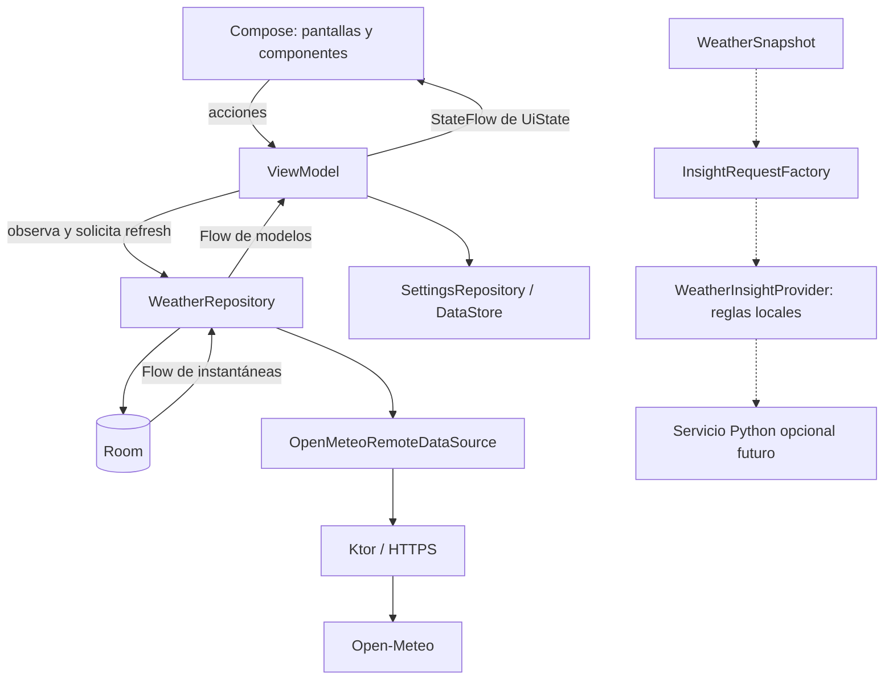

**Actualización I6a (2026-09-28):** Room y DataStore son la fuente durable; `Library.selected` puede ser null y la UI presenta bienvenida sin disparar pronóstico. [ADR-009](adr/009-mvp-quality.md) explica borrado y adaptación. El puerto de insights ya compila y tiene [reglas Kotlin locales](adr/010-local-insights.md), sin conexión a la UI. Hilt sigue como refactor futuro; el grafo es manual.

# Arquitectura propuesta

Este documento combina principios objetivo e implementación I0–I4 + I6a; donde dice «boceto» describe una alternativa histórica. ADR-008 documenta el esquema implementado, que retiene una cabecera por ciudad y usa locationId como clave de sus hijos; la propuesta de snapshotId persistente para historial sigue siendo futura. I6a usa un ID derivado de ciudad y fecha de descarga solo para correlacionar insights. El estado implementado de I0 + I1, sus clases reales y las diferencias transitorias están en [ADR-006](adr/006-first-slice.md) y [el recorrido de código](../LearnDocs/08-I0-I1-code-tour.md).

## 1. Estilo y límites

App de una Activity, interfaz Compose y flujo unidireccional. La UI emite acciones; el ViewModel coordina y publica estado; repositorios exponen modelos de la aplicación y ocultan persistencia/proveedores. Coroutines para operaciones y Flow para observación. Esta base coincide con las [recomendaciones Android](https://developer.android.com/topic/architecture/recommendations); el tamaño y los detalles siguientes son decisiones de ForeKast.



El diagrama muestra llamadas y datos, no dependencias de compilación. La rama punteada de insights aún no se invoca desde la UI. `ui` conoce contratos en `core/model` y `core/ports`; `data` implementa esos contratos; `di` conoce ambos. `core` no importa Compose, Room ni Ktor. Las dependencias hacia Android necesarias para recursos o disco quedan en sus adaptadores.

## 2. Organización inicial

```text
app/src/main/kotlin/<namespace>/
  ForeKastApplication.kt
  MainActivity.kt
  navigation/
  feature/weather/       # route, screen, ViewModel, UiState, componentes
  feature/search/
  feature/locations/
  feature/settings/
  core/model/            # datos normalizados, identidad, errores
  core/ports/            # contratos que realmente reemplazamos
  core/time/             # reloj y reglas temporales
  data/weather/remote/   # DTO y cliente Open-Meteo
  data/weather/local/    # tablas, DAO y conversiones
  data/weather/          # repositorio y mapper
  data/locations/
  data/settings/
  designsystem/          # tema, tokens y componentes compartidos
  di/                    # construcción y bindings Hilt
```

Un único módulo `:app` inicialmente. Los packages no impiden imports inválidos: revisar los límites en code review. Extraer módulos cuando exista reutilización real, trabajo paralelo o tiempos de build que lo justifiquen. La interfaz de red no se convierte en un “framework genérico de providers”.

## 3. Modelos y propiedad de la información

| Modelo | Responsabilidad y reglas |
| --- | --- |
| `Location` | UUID local, ID de geocoding opcional, nombre, región, país, coordenadas solicitadas, zona IANA |
| `WeatherSnapshot` | ID opaco local, locationId, provider, fetchedAt, zona, current opcional, horas y días |
| `CurrentWeather` | validAt, temperatura °C, sensación °C, humedad %, viento km/h, condición, isDay |
| `HourlyWeather` | Instant único, temperatura °C, probabilidad 0–100, condición, isDay |
| `DailyWeather` | LocalDate de ciudad, mínima/máxima °C, probabilidad máxima, condición |
| `WeatherCondition` | Condición normalizada y código original; variante Unknown |
| `WeatherUiState` | Ciudad, contenido formateado, refresh, aviso/error y frescura |

DTO modela el JSON externo; entidad modela almacenamiento; modelo de app expresa significado; UiState decide representación. Se crean mappers donde cambian esos contratos, evitando copiar estructuras por ceremonias. Los modelos de datos no contienen textos localizados ni referencias a recursos.

La identidad de una ciudad no es su nombre. Para selección manual, deduplicar por proveedor + ID de geocoding; mantener un UUID propio para no filtrar esa dependencia. No sustituir coordenadas solicitadas por el centro de grilla devuelto por el pronóstico. Guardar ambas si se necesitan para diagnóstico.

## 4. Contratos orientativos

```kotlin
interface WeatherRepository {
    fun observe(locationId: String): Flow<WeatherSnapshot?>
    suspend fun refresh(locationId: String, reason: RefreshReason): RefreshResult
}

enum class RefreshReason { EnterScreen, Foreground, Manual }

sealed interface RefreshResult {
    data object Updated : RefreshResult
    data object AlreadyFresh : RefreshResult
    data class Throttled(val retryAt: Instant) : RefreshResult
    data class Failed(val error: WeatherError) : RefreshResult
}
```

Es un boceto: tipos/imports y persistencia deben completarse en I2/I3. `observe` no inicia descargas. `refresh` valida y persiste; el contenido llega por el Flow. No se entregan dos versiones competidoras de datos, una por callback HTTP y otra por base local.

En I1/I2, un fake o almacenamiento en memoria implementa el mismo comportamiento observable. Solo I3 permite afirmar lectura offline después de cerrar el proceso. El uso de fuente local canónica es coherente con la [guía offline-first](https://developer.android.com/topic/architecture/data-layer/offline-first).

## 5. Persistencia

Room: `locations`, `weather_snapshots`, `hourly_weather`, `daily_weather`, `app_selection` y `refresh_policy`. Favoritos son un campo de Location con orden; una ciudad no favorita puede seguir siendo activa. `app_selection` contiene una referencia nullable y se modifica junto con Location en una transacción. Evitamos referencias entre Room y DataStore que requieran una transacción imposible entre ambos.

`weather_snapshots`: una cabecera por ciudad, con snapshotId y current nullable. Horas/días referencian snapshotId. Insertar cabecera, reemplazar hijos y retirar la anterior dentro de una transacción. La lectura agregada también debe ser transaccional para no combinar versiones. Índices únicos por snapshotId+Instant y snapshotId+LocalDate.

DataStore: unidad de temperatura y tema. Mantener una instancia por archivo. No guardar listas horarias como preferencias. En I4, exportar esquema Room y probar migraciones cuando exista una versión previa; no usar destrucción silenciosa de favoritos como solución a migraciones. Referencias: [Room](https://developer.android.com/training/data-storage/room) y [DataStore](https://developer.android.com/topic/libraries/architecture/datastore).

Retener hasta cinco favoritos y una ciudad activa no favorita. Al cambiar selección, purgar ciudades no favoritas que ya no estén activas y sus snapshots. Las políticas de TTL se aplican independientemente de esa limpieza. Una ciudad favorita permanece aunque su caché expire.

## 6. Concurrencia y ciclo de vida

- El ViewModel usa `viewModelScope`. Nunca `GlobalScope` ni `runBlocking` en UI.
- DAO/cliente ofrecen operaciones suspend seguras de invocar desde Main; encapsular I/O bloqueante propio en el adapter y dispatcher adecuado. `suspend` no mueve trabajo pesado de hilo por sí solo.
- Una exclusión por locationId evita refresh simultáneos. Un segundo intento en vuelo se ignora/une; no se encola otro automáticamente. Tras obtener el lock, volver a evaluar frescura y cooldown.
- La búsqueda cancela al cambiar la consulta, con debounce y `distinctUntilChanged`. Limpiar inmediatamente el resultado anterior; validar el token de consulta antes de publicar por si un adapter no coopera con cancelación.
- Cambiar ciudad cancela el trabajo de pantalla anterior y cambia la suscripción. Una respuesta tardía conserva su locationId: jamás puede reemplazar el estado visible de otra ciudad.
- Capturar únicamente errores esperables. Propagar `CancellationException`; `runCatching` sin cuidado también captura cancelación.
- Observar estado en Compose con `collectAsStateWithLifecycle`; la suscripción no es un permiso para repetir llamadas HTTP durante recomposición.
- El estado puede derivarse mediante `stateIn` y `WhileSubscribed(5_000)`. Elegir el timeout como política de suscripción, no como caché duradera.

Estas reglas se apoyan en las [prácticas de coroutines](https://developer.android.com/kotlin/coroutines/coroutines-best-practices). El control de concurrencia de ForeKast es una propuesta que debe probarse con carreras y cancelación.

## 7. Estado que sobrevive y estado que no

ViewModel conserva estado durante cambios de configuración, no después de la muerte del proceso. `remember` conserva durante la vida de esa composición. `rememberSaveable`/`SavedStateHandle` sirven para entradas pequeñas recuperables, como consulta o clave de destino; Room y DataStore guardan información duradera. Al restaurar, volver a observar persistencia y reevaluar frescura. Ver [guardar estado en Compose](https://developer.android.com/develop/ui/compose/state-saving).

Mensajes importantes, como “No se pudo actualizar”, pertenecen al estado. Una navegación disparada por el usuario puede manejarse en la route. Evitar canales efímeros para resultados que perderse haría incoherente la pantalla. Los estados de error se traducen a mensajes en UI; no filtrar stack traces ni textos crudos del proveedor.

## 8. Inyección, errores y extensibilidad

El grafo manual actual construye cliente HTTP, base local, repositorios y ViewModels. Si se introduce Hilt después, usar scope de aplicación solo para recursos compartidos; no convertir todas las clases en singleton. [Guía Hilt](https://developer.android.com/training/dependency-injection/hilt-android).

Errores de aplicación: `NetworkUnavailable`, `Timeout`, `RateLimited(retryAt)`, `ServiceUnavailable`, `InvalidResponse`, `LocalStorageFailure`. La UI tiene un mensaje genérico de último recurso. Si no puede persistirse una respuesta válida, conservar el snapshot anterior y comunicar el problema; no afirmar “actualizado”.

El puerto y las reglas locales están en `core/insights`; el futuro adapter Python se describe en [PYTHON_AI](PYTHON_AI.md). No se introduce un use case universal de agentes en el repositorio meteorológico. La factoría de I6a combina el pronóstico con la entrada del caso de uso; la redacción por IA sería otro adapter.
