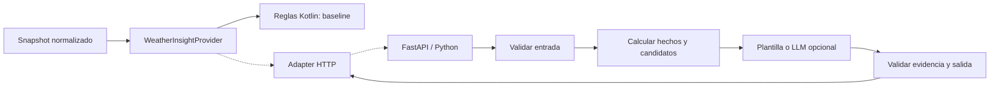

# Extensión Python y agentes

## 1. Hook previsto

La extensión responde una pregunta acotada a partir de un pronóstico ya descargado. El contrato Kotlin compilado está en [WeatherInsightProvider.kt](../app/src/main/kotlin/dev/bruze/forekast/core/insights/WeatherInsightProvider.kt), el contrato HTTP en [insights.openapi.json](../contracts/insights.openapi.json). I6a implementa reglas Kotlin locales; todavía no hay backend ni UI de insights.



MVP: capacidad deshabilitada, sin tráfico ni tarjeta vacía. I6a: implementación de reglas Kotlin fuera de la UI; I7: reglas equivalentes en Python vía HTTP; I8: redacción o agente con herramientas. La [elección ADR-004](adr/004-python-extension.md) evita que el servicio sea dependencia del pronóstico. Las reglas actuales y sus límites se explican en [ADR-010](adr/010-local-insights.md).

## 2. Caso inicial

“Resumí las próximas horas de esta ciudad”. El dispositivo construye una solicitud con hasta 24 muestras futuras, unidades canónicas y snapshotId. Puede omitir por completo nombre/coordenadas: para describir temperaturas y probabilidades ya presentes no son necesarios.

Modo `day_summary`: síntesis del intervalo enviado. Modo `walk_window`: duración deseada en minutos y ranking de ventanas. Inicialmente se admiten 30, 60 o 120 minutos; una muestra por hora no puede asegurar detalle a nivel minuto. La UI y el servicio explican esa resolución.

No se infiere una condición médica ni se afirma seguridad personal. “Menor probabilidad de precipitación en los datos disponibles” es una propiedad comprobable; “garantizado que no llueve” no lo es.

## 3. Contrato v1

`POST /v1/weather-insights`, JSON, operación síncrona corta. Entrada: schemaVersion, requestId, snapshotId, fetchedAt, timezone, locale, mode, hours y walkDurationMinutes opcional. Cada hora contiene timestamp, temperatureC y precipitationProbabilityPct; valores meteorológicos pueden ser null. No se envía historial de preferencias ni identificador de usuario.

Salida: status (`ok` o `no_insight`), requestId y snapshotId originales, generatedAt, expiresAt, method (`rules` o `llm`) e insights. Cada insight tiene título, cuerpo y referencias a `timestamp` + `field` existentes en la solicitud. `limitations` expresa datos faltantes, resolución o abstención. No se necesita un “confidence: 0.92” sin calibración.

Errores: 400 solicitud incompatible, 401 no autenticado, 413 demasiado grande, 422 validación, 429 cuota, 503 servicio temporalmente no disponible. JSON de error estable con code y message; mensaje técnico no se muestra directamente al usuario. El esquema y los ejemplos son la fuente de verdad de estructura; este documento añade invariantes de negocio.

## 4. Invariantes fuera del JSON Schema

- `schemaVersion` es `1.0`; cambio incompatible requiere `/v2`.
- Horas únicas y ordenadas, futuras respecto al reloj del servicio con tolerancia de desfase de cinco minutos; zona IANA válida y locale admitido.
- Snapshot descargado hace como máximo seis horas; si es más antiguo, responder `no_insight` con limitación, sin invocar LLM.
- RequestId y snapshotId se devuelven sin modificarse. Si la app cambió snapshot/ciudad, descarta respuestas tardías.
- `expiresAt > generatedAt` y nunca posterior a generatedAt+1h. Para status `ok`, además no puede superar fetchedAt+6h; una abstención por datos antiguos puede cachearse hasta una hora sin considerarse un insight vigente.
- `ok` exige al menos un insight; `no_insight` exige lista vacía y una limitación.
- Toda referencia de evidencia existe en la solicitud y no apunta a un valor nulo. Comprobar hechos/valores de texto por separado: tener una referencia no demuestra fidelidad semántica.
- Límite de body 32 KiB; máximo 24 horas, tres insights y seis evidencias por insight. Máximo 600 caracteres en cuerpo.

Fechas de ejemplos son fijas y sintéticas; en pruebas temporales se fija el reloj. No usarlas como requests “actuales” meses después.

## 5. Resiliencia y límites

Timeout de cliente 8 s; sin retry automático para POST en v1. El usuario puede pedir nuevo intento con otro requestId. Cancelar cliente no garantiza cancelar trabajo ya iniciado en servidor: backend impone su propio deadline y presupuesto.

Cachear por snapshotId+mode+locale+duración+versión del método, solo hasta expiresAt. Servidor puede reutilizar resultado de requestId repetido dentro de diez minutos, sin repetir inferencia; si mismo ID trae payload diferente, rechazar con 400. No hace falta cola de jobs o streaming hasta que un caso requiera trabajos largos.

UI tiene estados separados `Hidden`, `Loading`, `Ready`, `NoInsight`, `Unavailable`. Un fallo no borra pronóstico ni cambia frescura meteorológica. El método y la fecha de generación son visibles al inspeccionar el insight.

## 6. Python propuesto

FastAPI + Pydantic para validar modelos y exponer OpenAPI, pytest para reglas y contrato. FastAPI ofrece integración con estos estándares; usarlo no implementa automáticamente nuestros invariantes. [Documentación FastAPI](https://fastapi.tiangolo.com/features/).

Estructura futura:

```text
python-insights/
  app/main.py
  app/contracts.py
  app/rules.py
  app/service.py
  app/providers/llm.py
  tests/fixtures/
  tests/test_rules.py
  tests/test_contract.py
  pyproject.toml
```

Comenzar con una función pura `generate_insights(request, clock)`; exponer HTTP después. No elegir un framework de agentes todavía. Al llegar a I8 se compara SDK simple contra framework según herramientas, estado y observabilidad que realmente hagan falta.

## 7. De reglas a agentes

Baseline: filtrar horas sin datos suficientes, calcular rangos y escoger ventanas con una función de puntuación explícita. Ejemplo experimental: penalizar mayor probabilidad de precipitación y distancia a temperatura preferida; pesos visibles y configurables en laboratorio. No presentar una preferencia como verdad meteorológica.

Agente acotado: recibe petición estructurada; puede invocar `summarize_hours` y `rank_windows` sobre la misma entrada; produce JSON validado. Máximo tres llamadas de herramienta, un intento de corrección de formato y deadline total. Las herramientas no tienen shell, navegación arbitraria ni permisos para actuar en cuentas del usuario.

El texto de ciudad o contenido externo se trata como datos, no instrucciones. Los hechos numéricos se calculan mediante código. Si el modelo inventa cifras, evidencia o formato, descartar salida y usar plantilla o abstención. Una herramienta que consulta datos adicionales requiere una nueva decisión de procedencia y caché.

## 8. Privacidad y operación al activarlo

La primera activación explica qué datos salen del dispositivo. Se envía únicamente el intervalo seleccionado; coordenadas omitidas por defecto. Claves LLM permanecen en servidor. Para un endpoint expuesto, usar HTTPS, rate limiting y autenticación real de sesión; una clave estática embebida en APK no es secreto.

El contrato documenta Bearer auth, cuya emisión se implementará en I7 si hay acceso remoto. Un laboratorio loopback puede desactivar auth mediante configuración local explícita; no se despliega esa configuración. Los cuerpos no se registran por defecto; trazas solo de duración, tokens/costo y resultado. Desactivar función debe cortar futuras solicitudes y borrar su caché local.

## 9. Evaluación antes de un LLM

Crear al menos 30 casos: seco, lluvia probable, calor/frío, nulls, cobertura corta, DST, datos antiguos, resultados sin ventana y texto de entrada adversarial. Criterios propuestos: 100 % de schema válido o fallback; cero referencias inexistentes; cero cambios de cifras; abstención correcta en faltantes; comparación humana de utilidad contra plantilla. Medir latencia p50/p95 y costo por insight con presupuesto fijado antes del experimento.

No adoptar agentes si no mejoran la utilidad respecto de reglas simples. Esa conclusión también sería un resultado de aprendizaje válido.
